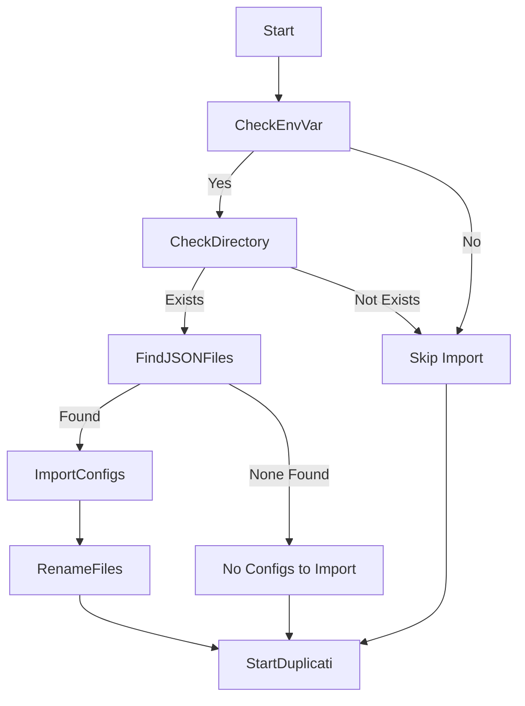

# Duplicati Backup Stack

Duplicati is a backup software that allows you to store backups securely encrypted on cloud storage services and remote file servers. This stack sets up Duplicati in a Docker container with an automated configuration import mechanism to simplify initial setup and configuration management.

## Overview

This stack provides:

- A Duplicati service running in a Docker container.
- Automatic import of backup configurations from JSON files.
- The ability to manage configurations via configuration files rather than through the UI.

## How It Works

### Configuration Import Mechanism

Upon startup, the Duplicati container executes an entrypoint script (`entrypoint.sh`) that:

1. **Checks** if the environment variable `DUPLICATI__IMPORT_CONFIG` is set to a directory.
2. **Verifies** if the directory exists and contains `.json` configuration files.
3. **Imports** each `.json` configuration file using Duplicati's `ConfigurationImporter.exe`.
4. **Renames** the imported `.json` files to `.json.imported` to prevent re-importing.
5. **Starts** the Duplicati server with the specified environment variables and settings.

### Directory Structure

- **`/mnt`**: The root filesystem is mounted here, allowing Duplicati to access files for backup.
- **`/backup`**: Directory where backup files and logs are stored.
- **`/data`**: Duplicati's data directory (e.g., database files).
- **`/import`**: Directory from which configuration files are imported during startup.

### Environment Variables

- **`TZ`**: default is "Europe/Madrid"
- **`DUPLICATI__IMPORT_CONFIG`**: Path to the directory containing configuration `.json` files to import. Default is `/import`.
- **`DUPLICATI__WEBSERVICE_PASSWORD`**: Password for the Duplicati web interface.
- **`DUPLICATI__UNENCRYPTED_DATABASE`**: If set to `true`, uses an unencrypted database.
- **`DUPLICATI__DEBUG_LEVEL`**: Sets the log level (default is `Information`).

### Docker Compose Configuration

The `docker-compose.yaml` file defines the Duplicati service with the following key settings:

- **Image**: `ghcr.io/oriolrius/duplicati:v2.0.2`
- **Network Mode**: `host`
- **Volumes**:
  - **`/`** mounted to `/mnt` inside the container to allow access to the entire filesystem for backup purposes.
  - **`/backup`** mounted to `/backup` for storing backup files and logs.
  - **`./data`** mounted to `/data` for Duplicati's data storage.
  - **Import Directory**: The directory specified by `DUPLICATI__IMPORT_CONFIG` (default is `./import`) is mounted to `/import` inside the container.
- **Environment File**: `.env` (contains environment variable definitions).

## Configuration Import Process

Below is a detailed explanation of how the configuration import mechanism works.

### Process Flow



1. **Start**: The entrypoint script starts.
2. **Check Environment Variable**: Checks if `DUPLICATI__IMPORT_CONFIG` is set.
3. **Check Directory**: Verifies if the specified directory exists.
4. **Find JSON Files**: Looks for `.json` files in the directory.
5. **Import Configs**: Imports each configuration using Duplicati's Configuration Importer.
6. **Rename Files**: Renames imported files to prevent re-importing.
7. **Start Duplicati**: Launches the Duplicati server with specified arguments.

### Entry Point Script Overview

The `entrypoint.sh` script performs the following:

- **Imports Configurations**: Uses `mono-sgen Duplicati.CommandLine.ConfigurationImporter.exe` to import `.json` files.
- **Runs Logrotate**: Executes `logrotate` in the background to manage log files.
- **Parses Environment Variables**: Constructs arguments for the Duplicati server based on environment variables.
- **Starts Duplicati Server**: Runs `/usr/bin/duplicati-server` with the constructed arguments.
- **Tails Log File**: Continuously outputs the log file for monitoring purposes.

## Getting Started

### Prerequisites

- Docker and Docker Compose installed.
- Access to the server's filesystem where backups will be stored.
- Backup configuration files exported from Duplicati in `.json` format.

### Setup Steps

1. **Clone the Repository**

   ```bash
   git clone https://github.com/sabatligats/iotgw_duplicati.git
   cd iotgw_duplicati
   ```

2. **Configure Environment Variables**

   Create a `.env` file or edit the existing one to set the necessary environment variables.

   Example `.env` file:

   ```env
   DUPLICATI__WEBSERVICE_PASSWORD=your_password
   DUPLICATI__IMPORT_CONFIG=./import
   DUPLICATI__UNENCRYPTED_DATABASE=true
   DUPLICATI__DEBUG_LEVEL=Information
   ```

3. **Prepare Configuration Files**

   Place your Duplicati configuration files (`.json`) into the `import` directory:

   ```bash
   mkdir import
   cp /path/to/your/config.json import/
   ```

4. **Start the Docker Stack**

   ```bash
   docker-compose up -d
   ```

5. **Access the Duplicati Web Interface**

   Open your web browser and navigate to `http://<your-server-ip>:8200`.

   Log in using the password set in `DUPLICATI__WEBSERVICE_PASSWORD`.

## Notes on Configuration

- **Import Directory**: The directory specified by `DUPLICATI__IMPORT_CONFIG` is mounted into the container at `/import`.
- **Configuration Files**: Must be in JSON format, as exported by Duplicati.
- **Post-Import**: After successful import, configuration files are renamed to prevent re-importing.
- **Backup Storage**: Ensure sufficient disk space is available in the `/backup` directory.

## Ansible Provisioning

The stack can be provisioned using Ansible, automating the deployment process.

### Key Actions Performed by Ansible

1. **Check for Existing Docker Stack**: Stops and removes any existing Duplicati stack.
2. **Remove Existing Directory**: Deletes the `/opt/stacks/duplicati` directory if it exists.
3. **Clone Repository**: Clones the Duplicati stack repository to `/opt/stacks/duplicati`.
4. **Add Git Pre-Push Hook**: Adds a pre-push hook for Git automation.
5. **Template Environment and Configuration Files**: Generates the `.env` file and backup configuration files using templates.
6. **Start Docker Stack**: Deploys the Duplicati stack using Docker Compose.

## Troubleshooting

- **Configuration Not Imported**: Ensure your `.json` files are in the correct directory and `DUPLICATI__IMPORT_CONFIG` is set correctly.
- **Permissions Issues**: Verify that the Docker user has read access to configuration files and necessary directories.
- **Service Not Starting**: Check the logs in `/backup/duplicati.log` for error messages.
- **Port Conflicts**: If port `8200` is in use, adjust the `--webservice-port` argument in the entrypoint script or modify the Docker Compose file.

## Security Considerations

- **Access Control**: Use a strong password for the web interface by setting `DUPLICATI__WEBSERVICE_PASSWORD`.
- **Data Encryption**: Leverage Duplicati's encryption features to secure your backups.
- **Database Encryption**: By default, the database is unencrypted if `DUPLICATI__UNENCRYPTED_DATABASE` is set to `true`. For increased security, set it to `false` or remove it.

## Conclusion

This stack provides an automated way to deploy Duplicati with the ability to import configurations from files, simplifying backup setup and management.

For any questions or issues, please refer to the repository or open an issue.
