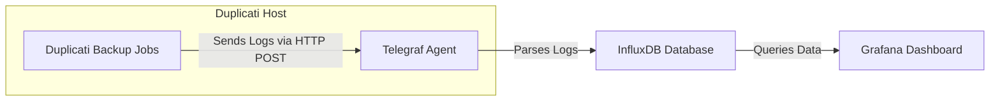

# Telegraf Stack for Monitoring Duplicati Backups

## Overview

This Telegraf stack is designed to monitor and visualize the results of Duplicati backup operations. By integrating **Telegraf**, **InfluxDB**, and **Grafana**, you can parse Duplicati logs, store them as time-series data, and create insightful dashboards to track backup performance and issues.

## How It Works

To illustrate the workflow, here's a Mermaid diagram showing how the components interact:



**Workflow Steps:**

1. **Duplicati Backup Jobs**:
   - Duplicati performs scheduled backup operations.
   - After each backup, it generates detailed logs containing the results of the operation.

2. **Sending Logs to Telegraf**:
   - A post-backup script in Duplicati sends the backup results in JSON format to Telegraf via an HTTP POST request to `http://localhost:8080/duplicati`.

3. **Telegraf Agent (HTTP Listener)**:
   - Telegraf listens on `localhost:8080` using the `http_listener_v2` input plugin.
   - Upon receiving a Duplicati log, Telegraf parses the JSON data.
   - It extracts relevant metrics such as backup name, duration, file counts, sizes, and any errors or warnings.

4. **Forwarding Metrics to InfluxDB**:
   - Telegraf uses the `influxdb_v2` output plugin to send the parsed metrics to InfluxDB.
   - Metrics are stored in a specified bucket within InfluxDB, organized with tags (e.g., `backup-name`) for efficient querying.

5. **Grafana Dashboard**:
   - Grafana connects to InfluxDB as a data source.
   - Custom dashboards are created to visualize backup performance over time.
   - Users can monitor backup statuses, durations, error counts, and receive alerts for failures or anomalies.

**Key Points:**

- **Data Flow**: Duplicati ➔ Telegraf ➔ InfluxDB ➔ Grafana.
- **Communication Protocol**: HTTP POST requests on `localhost`.
- **Data Format**: JSON logs from Duplicati are parsed by Telegraf.
- **Storage**: InfluxDB stores time-series data for efficient retrieval.
- **Visualization**: Grafana provides real-time dashboards and alerting mechanisms.

## Why Use Telegraf for Parsing Duplicati Logs

Duplicati generates detailed logs after each backup operation but lacks native tools for parsing and visualizing this data over time. Telegraf bridges this gap by:

- **Automated Data Collection**: Continuously listens for backup logs without manual intervention.
- **Efficient Parsing**: Extracts only the necessary metrics from complex JSON logs.
- **Seamless Integration**: Works with InfluxDB and Grafana to provide a full monitoring stack.
- **Scalability**: Can handle multiple backup sources and large volumes of data.

By using Telegraf, you automate the collection and processing of backup logs, transforming them into actionable insights.

## Stack Components

### Telegraf

- **Role**: Data collection agent that parses Duplicati logs and sends metrics to InfluxDB.
- **Configuration**: Obtained dynamically from InfluxDB via an API endpoint, specified in the environment variable `CONFIG_TELEGRAF`.
- **Operation Mode**: Runs as a Docker container in host network mode to listen on the host's network interfaces.

### InfluxDB

- **Role**: Time-series database that stores the parsed backup metrics from Telegraf.
- **Telegraf Configuration Storage**: Hosts the Telegraf configuration, which Telegraf downloads at startup.

### Grafana

- **Role**: Visualization tool that creates dashboards based on the data stored in InfluxDB.
- **Functionality**: Allows you to monitor backup performance, identify failures, and analyze trends over time.

## Docker Compose Configuration

The Telegraf service is defined in the `docker-compose.yml` file:

```yaml
services:
  telegraf:
    container_name: telegraf
    image: telegraf:1.31.1-alpine
    network_mode: host
    command: '-config ${CONFIG_TELEGRAF}'
    restart: unless-stopped
    env_file:
      - .env
```

**Explanation**:

- **Image**: Uses the official Telegraf Docker image with version `1.31.1-alpine`.
- **Network Mode**: Set to `host` to allow Telegraf to listen on `localhost:8080`.
- **Command**: Specifies the configuration file location via the `-config` flag, using the environment variable `CONFIG_TELEGRAF`.
- **Environment Variables**: Loaded from the `.env` file to provide necessary configuration values.
- **Restart Policy**: Automatically restarts unless the container is explicitly stopped.

## Environment Variables

The `.env` file (templated as `env.j2` in Ansible) contains:

```env
INFLUX_TOKEN='your_influxdb_token'
CONFIG_TELEGRAF='your_telegraf_config_url'
```

- **INFLUX_TOKEN**: Authentication token for Telegraf to communicate securely with InfluxDB.
- **CONFIG_TELEGRAF**: URL from which Telegraf downloads its configuration file at startup.

## Telegraf Configuration Details

Although the actual `telegraf.conf` is downloaded dynamically, here's what it does and why it's essential:

### Global Agent Settings

- **Interval Settings**: Sets the data collection interval (e.g., every 10 seconds).
- **Buffer Sizes**: Configures how many metrics can be buffered before sending to InfluxDB to handle bursts of data.

### Output Plugin: InfluxDB v2

- **Destination**: Specifies the InfluxDB server URL, organization, bucket, and uses the `INFLUX_TOKEN` for authentication.
- **Function**: Sends the parsed metrics from Duplicati logs to InfluxDB securely.

### Input Plugin: HTTP Listener v2

- **Service Address**: Listens on `127.0.0.1:8080` for incoming HTTP POST requests from Duplicati.
- **Data Format**: Configured to accept data in JSON format.
- **JSON Parsing**:
  - **Fields Extracted**: Defines which JSON fields from the Duplicati logs to extract as metrics.
  - **String Fields**: Specifies which fields should be treated as strings.
  - **Tags**: Uses certain fields (like `backup-name`) as tags for efficient querying in InfluxDB.

### Data Parsing Logic

- **Metrics Collected**: Includes backup name, duration, file counts (added, deleted, modified), sizes, and any errors or warnings.
- **Tagging**: Tags metrics with the backup name to differentiate between multiple backup jobs or sources.

## Setting Up Duplicati to Send Logs to Telegraf

To enable Duplicati to send logs to Telegraf:

1. **Configure Duplicati Job**:
   - Go to **Advanced Options** in your backup job settings.
   - Add a `--run-script-after` option pointing to a script that sends the backup result to Telegraf.

2. **Create a Post-Backup Script**:
   - The script captures Duplicati's environment variables and constructs a JSON payload.
   - Uses an HTTP client (like `curl` in Unix/Linux or `Invoke-WebRequest` in PowerShell) to POST the JSON to `http://localhost:8080/duplicati`.

   **Example Script (Bash)**:

   ```bash
   #!/bin/bash
   # Duplicati Post-Backup Script
   curl -X POST -H "Content-Type: application/json" \
   -d "$DUPLICATI__RESULT" \
   http://localhost:8080/duplicati
   ```

   - **Note**: `$DUPLICATI__RESULT` contains the backup result in JSON format.

3. **Ensure Connectivity**:
   - Since Telegraf listens on `localhost`, Duplicati and Telegraf must run on the same host.
   - No additional firewall configurations are typically necessary for localhost communication.

## Visualizing Metrics with Grafana

Once data is stored in InfluxDB, you can use Grafana to create dashboards:

1. **Add InfluxDB Data Source**:
   - In Grafana, navigate to **Configuration > Data Sources**.
   - Add a new InfluxDB data source.
   - Provide the URL (e.g., `http://influxdb_host:8086`), organization, bucket, and `INFLUX_TOKEN`.

2. **Create Dashboards**:
   - Use Grafana's query builder or write queries to select metrics like backup duration, file counts, and errors.
   - Visualize data using graphs, tables, and other panels.

3. **Set Up Alerts**:
   - Configure Grafana to send notifications if backups fail or if certain thresholds are exceeded (e.g., backup duration too long).

## Local Telegraf Configuration

The `local/` directory contains a standalone Telegraf configuration file (`telegraf.conf`):

- **Purpose**: Allows for local testing or scenarios where dynamic configuration from InfluxDB is not preferred.
- **Usage**:
  - Modify the `docker-compose.yml` command to point to the local configuration:

    ```yaml
    command: '-config /local/telegraf.conf'
    ```

  - Ensure that the local configuration matches the settings required for your environment.

- **Benefits**:
  - Quick testing and debugging without relying on InfluxDB's API.
  - Easier customization for specific use cases.

## Benefits of This Setup

- **Automated Monitoring**: Eliminates the need for manual log inspection by automating data collection and visualization.
- **Centralized Data**: Stores all backup metrics in a centralized database, making it easier to manage and analyze.
- **Customizable Dashboards**: Grafana allows for tailored dashboards to meet specific monitoring needs.
- **Scalability**: This setup can be extended to monitor multiple Duplicati instances or additional services by adjusting Telegraf's configuration.

## Conclusion

By integrating Telegraf with Duplicati, InfluxDB, and Grafana, you gain a powerful toolset for monitoring backup operations. This setup ensures you are immediately aware of any issues, can track backup performance over time, and have access to detailed logs for troubleshooting.

## Additional Resources

- **Telegraf Documentation**: [Telegraf Input Plugins](https://github.com/influxdata/telegraf/tree/master/plugins/inputs)
- **Duplicati Documentation**: [Advanced Options](https://duplicati.readthedocs.io/en/latest/05-advanced-options/)
- **InfluxDB Documentation**: [InfluxDB v2 API](https://docs.influxdata.com/influxdb/v2.0/api/)
- **Grafana Documentation**: [Getting Started with Grafana](https://grafana.com/docs/grafana/latest/getting-started/)
